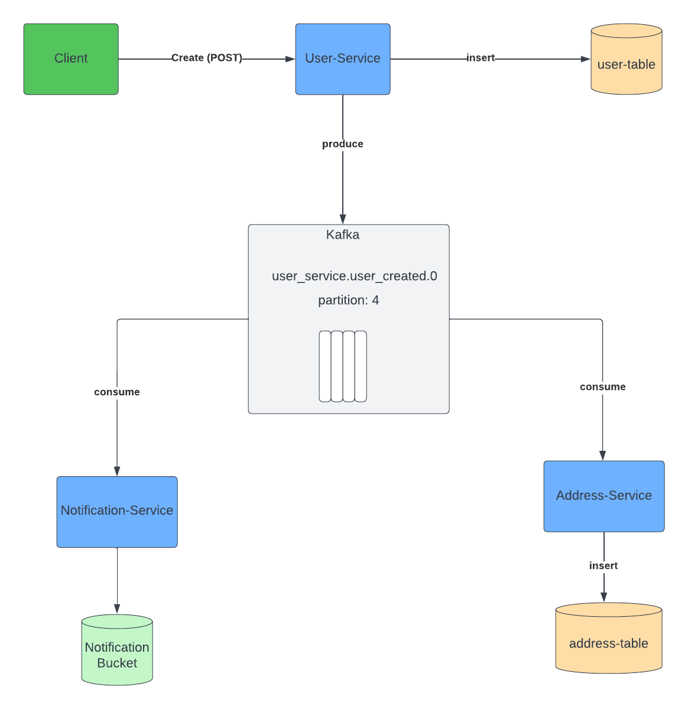
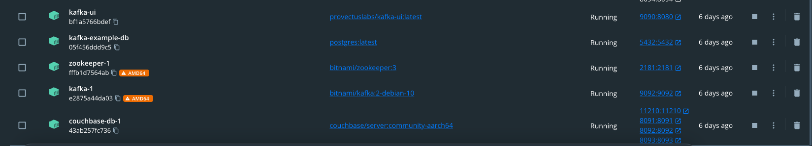
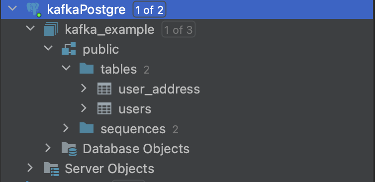
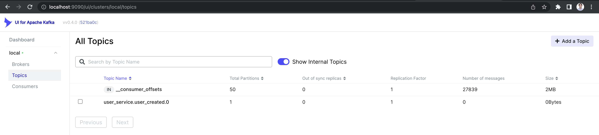
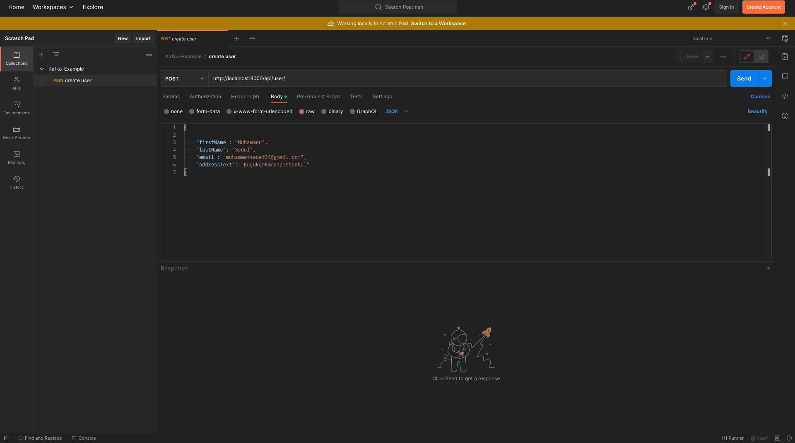
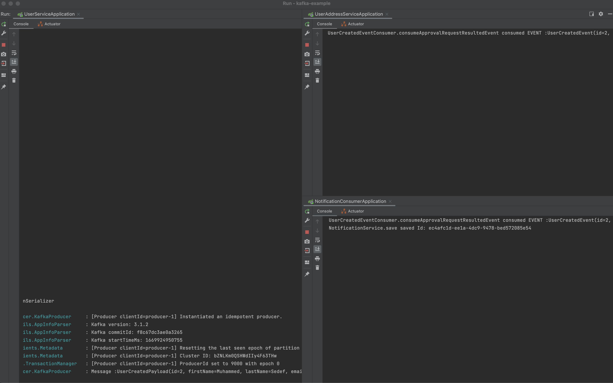
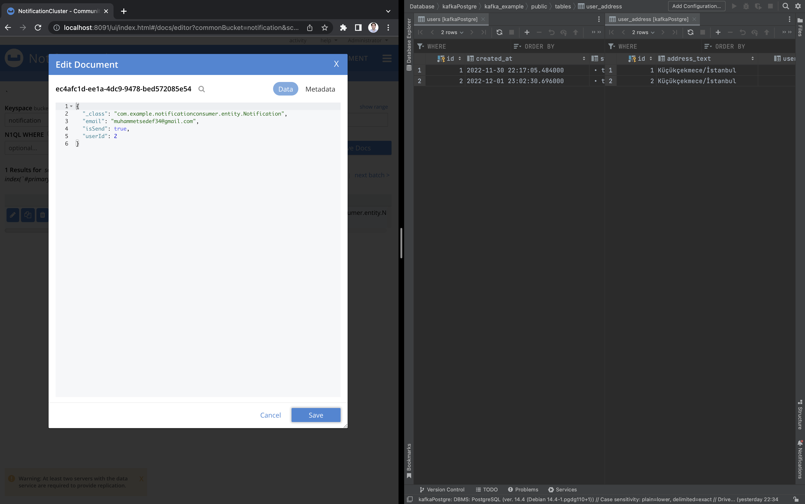
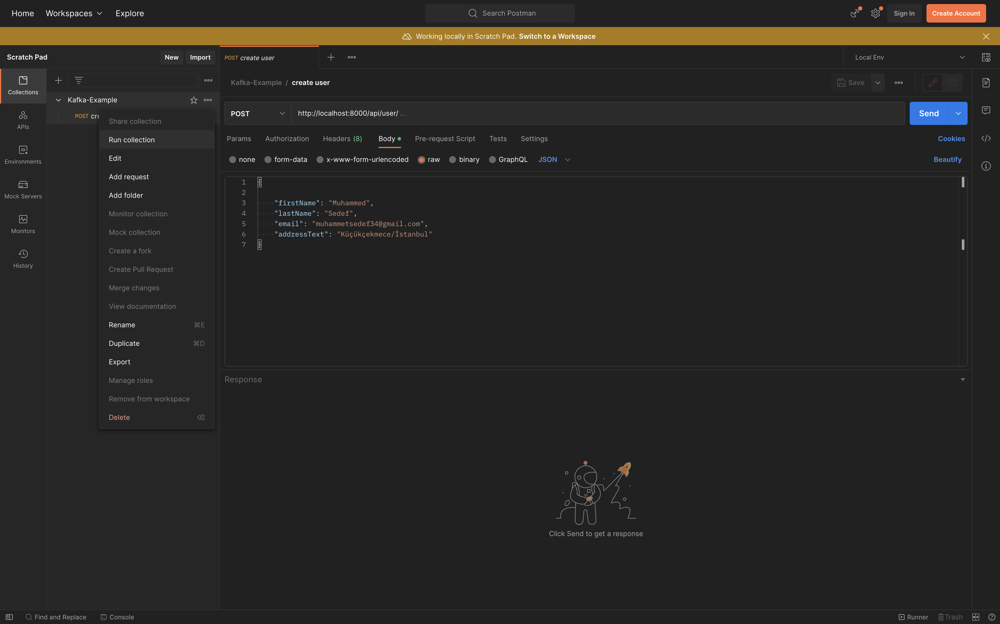
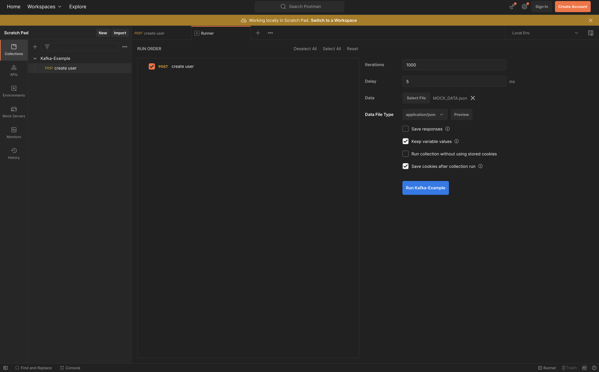

# Kafka-Example
In this project, 
- There are 3 microservices, when a user created via user-service that service insert a record onto user table(postgre) 
and it produce an event to **user_service.user_created.0** topic. 
- Notification-consumer service listen **user_service.user_created.0** topic and simulates the logic of sending 
notification after the event it consumes after notification is sending successfully service insert a record onto couchbase
notification bucket.
- User-address-service also listen user_service.user_created.0 topic and it consume events. According to user's address text
information it insert a record onto user-address table(postgre)

## System Architechure

## Setup
- Before run project you need to start docker desktop
- After docker is up, run the docker-compose.yml (You can find it in the infra-setup folder.)
- After the run docker-compose.yml file you will see docker desktop like this: 

- Continue With DB Connection Part

- # Running
- #### Run each project application file on your code ide.
- #### After you run 3 application successfully you can check postgre db on your GUI you have to see created 2 tables which names ara **user** and **user_address**

- #### Check Topic is created or not http://localhost:9090/ (kafka ui)

- #### If you have come this far without any problems, we can open postman and try a sample request.
- #### You can import postman collection which I share in postman_collection folder

- #### After execute post endpoint and get 200 success message from postman you can see producer and consumer logs on your running terminal also you can check that records are in your databases  

- #### As you can see our records successfully inserted to our databases
- #### To test batch request use MOCK DATA.json file which it is in postman folder, open the postman runner and select that json file and run.

